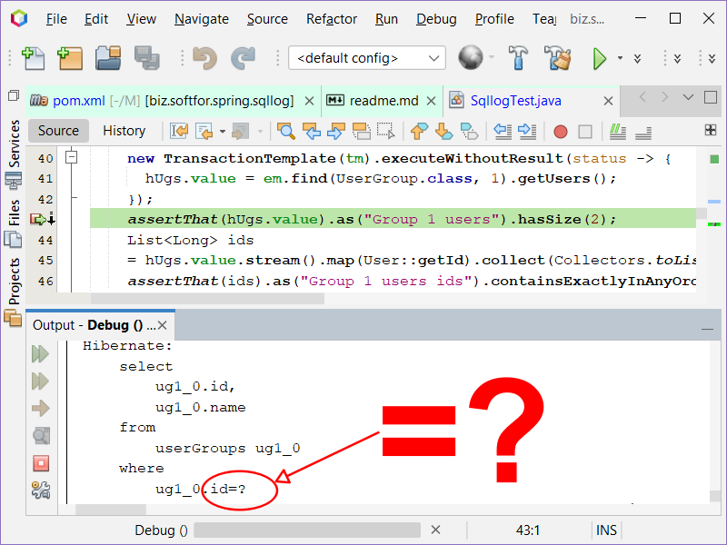

<h1 align="center">biz.softfor.jpa.sqllog</h1>
<p align="right">
  <a href="readme.ua.md">UA</a>
  <a href="readme.md">EN</a>
</p>



— это Spring Boot стартер для логирования SQL запросов при тестировании и отладке.

Получить в логах текст SQL запроса с параметрами очень просто.
Добавьте зависимость в __POM__-файл Вашего Sprig Boot приложения:
```xml
<dependency>
  <groupId>biz.softfor</groupId>
  <artifactId>biz.softfor.spring.sqllog</artifactId>
  <version>3.4.4</version>
</dependency>
```

Часто в сценариях использования ORM или других сторонних библиотек мы бы хотели
контролировать состав и количество запросов к БД. Используйте для этого класс
__SqlCountValidator__:
```java
SqlCountValidator validator = new SqlCountValidator(em);
... business logic ...
validator.read(2).insert(4).update(1).delete(1).assertTotal();
```

Также возможна __предварительная__ установка параметров для assert:
```java
SqlCountValidator validator
= SqlCountValidator.builder().insert(4).entityManager(em).build();
... business logic ...
validator.assertTotal();
```

Эти примеры взяты из [автотестов](src/test/java/biz/softfor/spring/sqllog/) пакета.

При разработке я использовал статью Vlad Mihalcea
[The best way to log SQL statements with JDBC, JPA or Hibernate](https://vladmihalcea.com/the-best-way-to-log-jdbc-statements/).
Я оформил код в виде Spring Boot starter, убрал дублирование логирования
batch-запросов и добавил счётчик запросов.

## Лицензия

Этот проект имеет лицензию MIT - подробности смотрите в файле [license.md](license.md).
